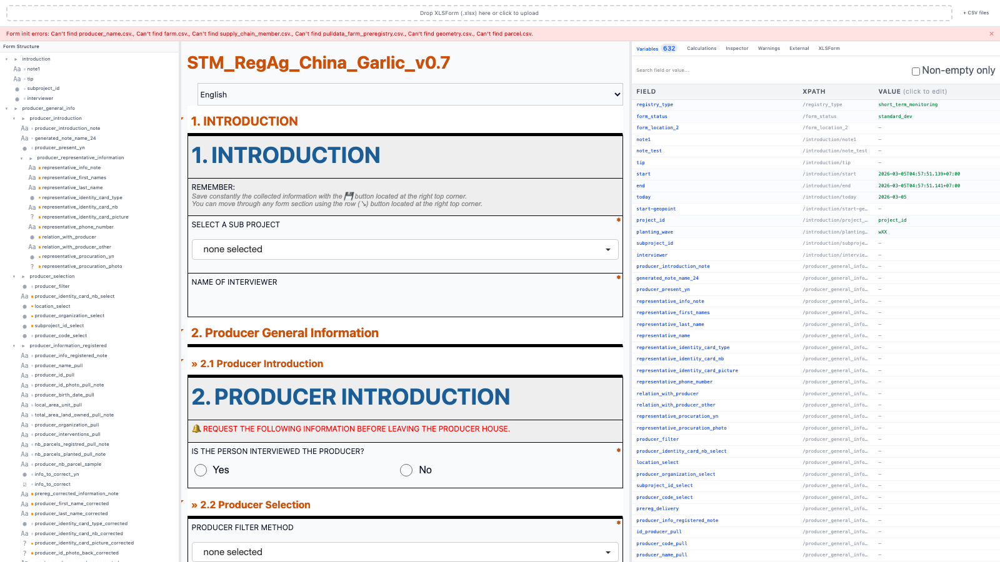
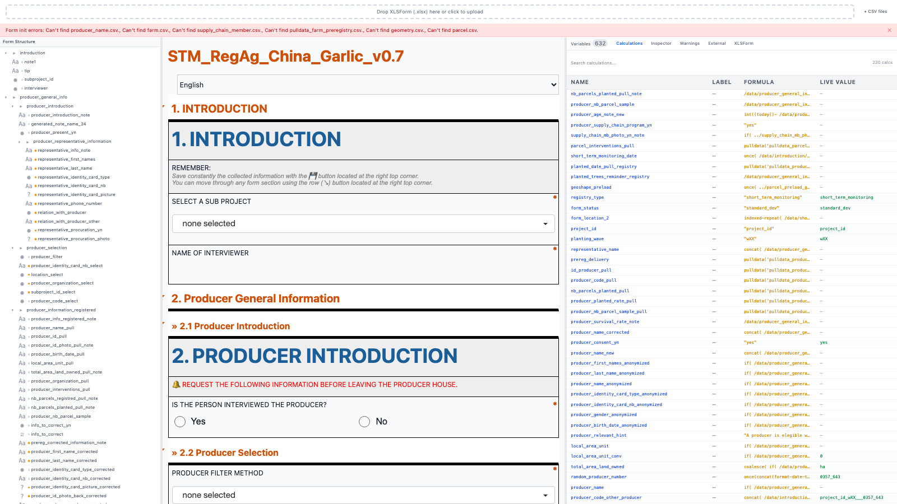
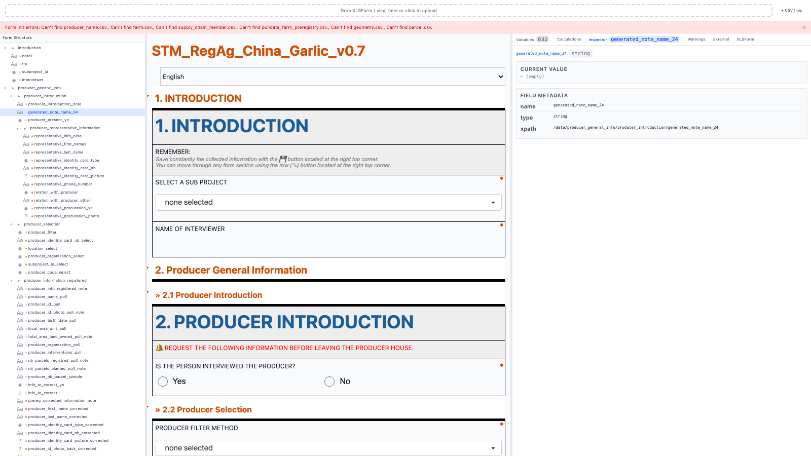
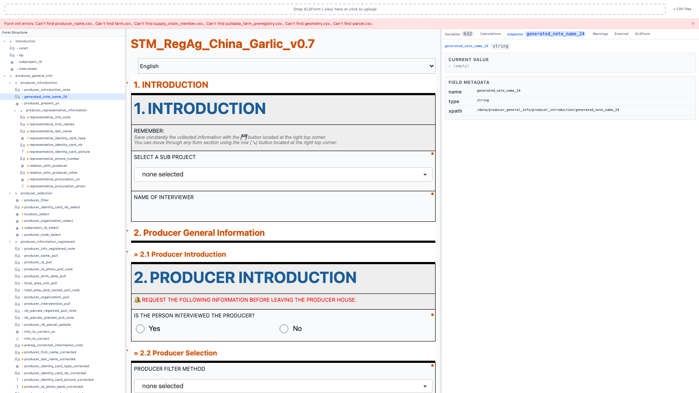

# XLSForm Debugger v2

> Debug your KoboToolbox / ODK XLSForms locally before deployment.
> Uses the same **enketo-core** renderer as KoboToolbox — what you see here is exactly what your field team sees.



---

## What it does

- **Renders your form exactly as KoboToolbox would** — same engine (enketo-core), same logic
- **Loads your pulldata CSVs** — see real values resolve in the form
- **Live variable inspector** — all 600+ variables with current values, editable for testing
- **Calculations panel** — every `calculate` field with its formula and live output
- **Question inspector** — click any question to see its metadata, relevant/constraint evaluation, dependencies
- **Form structure tree** — collapsible hierarchy of all groups, repeats, and questions with status indicators
- **Warnings** — catches undefined variable references, missing CSVs, malformed expressions
- **XLSForm source viewer** — browse the raw survey/choices sheets without opening Excel

---

## Screenshots

### Form rendered alongside debug panels


### Calculations — live values for all calculated fields


### Inspector — click any question to inspect metadata, relevance, dependencies


### Variables — all form variables, editable for testing


---

## Setup

### Prerequisites
- Python 3.10+
- Node.js 18+
- Git

### 1. Clone
```bash
git clone https://github.com/achmadnaufal/xlsform-debugger-v2.git
cd xlsform-debugger-v2
```

### 2. Install API dependencies
```bash
cd api
pip install -r requirements.txt
```

### 3. Install frontend dependencies
```bash
cd app
npm install
```

### 4. Start the API
```bash
cd api
uvicorn main:app --port 5050
```
Keep this terminal open.

### 5. Start the frontend *(new terminal)*
```bash
cd app
npm run dev
```

### 6. Open
→ **http://localhost:5173**

---

## How to use

### Loading your form
1. Drag and drop your `.xlsx` file onto the upload bar at the top
2. Click **+ CSV files** to load your pulldata CSVs (e.g. `pulldata_producer_stm.csv`)
3. The form renders automatically

### The 3 panels

| Panel | What it shows |
|---|---|
| **Left** | Form Structure — full group/repeat/question tree, click to scroll the form |
| **Center** | Rendered form — interact with it as a field enumerator would |
| **Right** | Debug tabs — Variables, Calculations, Inspector, Warnings, External Data, XLSForm source |

All 3 panels are **resizable** — drag the dividers between them.

### Debug tabs

**Variables** — All form variables and their current values. Click any value cell to override it live (useful for testing skip logic without filling the whole form).

**Calculations** — Every `calculate` field with its formula and live output. Auto-refreshes as you fill the form. Instantly see if a `pulldata()` is resolving correctly or returning NaN.

**Inspector** — Click any question in the form or the structure tree. Shows: type, label, relevant condition (✅ visible / 🚫 hidden), constraint (✅ passes / ❌ fails), current value, and which other fields depend on it.

**Warnings** — Static analysis: undefined `${variable}` references, missing CSV files, malformed expressions.

**External Data** — Lists all loaded CSVs with row counts and column headers.

**XLSForm Source** — Browse the survey and choices sheets as a table without opening Excel.

### Tips for debugging pulldata()

1. Load your pulldata CSV via **+ CSV files**
2. Open **Calculations** tab — find your `pulldata()` field
3. If the live value shows `—` or NaN, check:
   - CSV filename matches exactly what's in the formula
   - The key column in your CSV matches the filter value you're selecting
4. Override the filter field value directly in **Variables** to test different producers/parcels

### Tips for debugging skip logic (relevant)

1. Open **Inspector** tab
2. Click the question that's not showing/hiding correctly
3. The relevant expression is shown with live evaluation — ✅ means currently visible
4. Click the dependency chips to jump to the fields it depends on
5. Or use **Variables** to override a field value and watch the form re-evaluate live

---

## Sharing with your team (local network)

Start both services with network exposure:

```bash
# Terminal 1 — API
cd api
uvicorn main:app --host 0.0.0.0 --port 5050

# Terminal 2 — Frontend
cd app
npm run dev -- --host
```

Share your machine's IP: **http://192.168.x.x:5173**

Teammates only need a browser — no installation required on their end.

---

## Tech stack

| Layer | Tech |
|---|---|
| Form renderer | [enketo-core](https://github.com/enketo/enketo-core) — same engine as KoboToolbox |
| XLSForm conversion | [pyxform](https://github.com/XLSForm/pyxform) via FastAPI |
| Frontend | React 19 + TypeScript + Vite + Tailwind CSS |
| Panels | react-resizable-panels |

---

## Notes

- The renderer is **unmodified enketo-core** — no custom patches. If it works here, it works in Kobo.
- `jr://` image URLs in form hints will show a broken image in the browser — expected, doesn't affect form logic.
- GPS/geoshape fields render but won't capture real coordinates in a browser environment.
